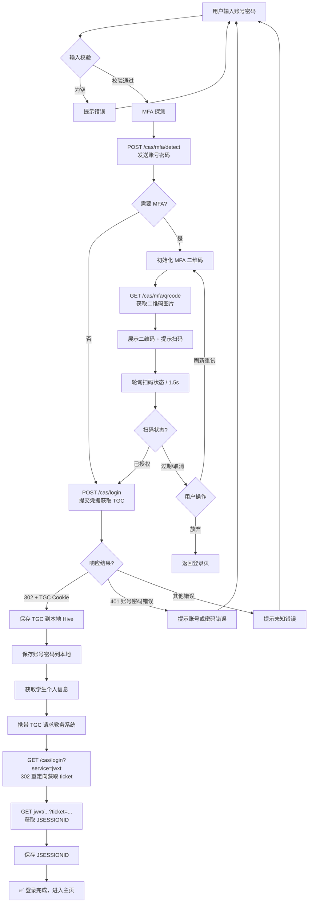

# 智慧尼采 SmarterJxUFE

江西财经大学智慧江财的第三方客户端，但是受限于课程时间，目前仅实现教务系统中的培养方案查询、课表查询、成绩查询和个人信息查询四个子功能。

## 0xFF 绪

在江财，学生们每天的工作、学习、生活都离不开智慧江财。

但智慧江财身上的历史包袱似乎太沉。与其说智慧江财是一个软件、一个小程序、一个网站，不如说智慧江财是一个**门户**。学生们确实可以在这里方便地跳转到不同的具体功能页，但它太笨重了，使用起来有诸多不便。

因此从寒假起，我便着手开始计划着实现一个第三方客户端。本学期正好有《程序设计实训》课程，于是决定就做这个项目了。

## 0x00 开发背景

智慧江财每天被全校师生高频使用，但是由于很多因素的影响，智慧江财在使用上多有不便：

- **移动端体验差**: 网页的移动端适配并不完全，在手机上查课表、看成绩极为不便
- **功能不够丰富**: 例如缺乏数据可视化、数据分析等功能
- **交互体验差**: 很多操作逻辑不合理，操作流程过度复杂
- **数据来源不统一**: 同样的成绩，既可以在教务系统里查到，也能在成绩管理系统里查到
- **可扩展性差**: 功能基本固定，没有提供可扩展的方式。

## 0x10 需求分析

立项之初，我只能走访身边同学，收集对智慧江财现有平台的痛点和期望改进点。希望日后项目做起来了能和学校智慧江财的管理员取得联系，并获取一些信息。

对于目前已实现的培养方案、课表、成绩和个人信息四个模块，其实我身边同学的反响不是特别大。最大的反响就是希望能**简化登录流程**。

因为智慧江财为了保护账号安全，`Cookie` 基本半天就会失效，重复登录非常麻烦。反而可能让某些同学依赖于浏览器的自动保存密码来快速登录，这样反而让账户**更不安全**了。同时，即使 `Cookie` 没有失效，每次刷新页面后也要手动再点一下登录按钮。所以我就着重实现了自动登录逻辑。

不过，本地存储账密，然后每次都自动登录也不是一个好主意。一方面，可能很久不输密码会导致忘记密码；另一方面，这样也会导致账密不安全。虽然目前还没有相应的措施，不过我未来打算要求隔一段时间就登录一次。当然，肯定不像原系统要求的那么频繁，大概一到两周一次是够的。

## 0x20 技术选型

起初的技术选项卡了我很久。

过去我也尝试过许多技术栈了。有 `Java` + `JavaFx`, `C++` + `EasyX`, `HTML` + `CSS` + `JavaScript`, `C++` + `Qt`, `Python` + `PyQt`, `Python` + `Thinker`。

但是我感觉都不是很好用。这一次我需要跨平台能力，希望可以一次编写，然后直接发布在 `Windows`, `MacOS`, `Android`, `iOS` 四个平台。那么无法就是三种选择：

| 技术栈                 | 开发难度 | 性能 |
| ---------------------- | -------- | ---- |
| `JavaScript` + `React` | 简单     | 差   |
| `Dart` + `Flutter`     | 适中     | 适中 |
| `C++` + `Qt`           | 难       | 高   |

~~可能是因为刻在中国人骨子里的中庸吧~~，我最后选了开发难度和性能平衡的 `Dart` + `Flutter`。

## 0x30 项目架构

一开始我是没怎么注意项目架构的。毕竟当时项目体量还小，**快速验证**想法才是最重要的。但是项目体量一大起来，就必须要使用一些项目架构和设计模式了。

在 `Flutter` 社区一逛，我发现 `MVVM` 架构可为如日中天，而 `Dart` 这门语言本身也挺契合这种架构的。于是我毫不犹豫地就选了这个架构。

`MVVM` 也即 `Model-View-ViewModel` 架构。其核心是将每个功能都拆分为 `Model` `View` `ViewModel` 这三层。其中 `Model` 层是纯数据层，`View` 是纯 UI 层，而 `ViewModel` 层则负责 `Model` 层和 `View` 层之间的通信，以及管理 UI 状态。这让我原本混乱无比的项目一下子就清晰起来。

但是由于智慧江财后端返回的原始数据很脏乱，几乎每个远程数据源都需要进行一次数据清洗。在社区逛了一会后我决定引入 `防腐层`。将请求返回的原始数据先包装，然后再写一个转换器，这样如果后端变动，我只需要重写防腐层的代码，而不会影响到核心代码。

## 0x40 登录实现

首先，项目起步时，最先卡住我的，也是卡住我时间最长的地方就是登录授权了。

最开始，为了快速验证想法，我决定手动复制一下 `Cookie` 凑合一下。结果一凑合就是一个学期了快。后面终于还是实现了自动授权登录。

登录分为两部分逻辑，首先要完成对统一授权的登录，然后再通过统一授权登录不同的子系统。

登录的过程过于复杂，故直接看下面的流程图吧：



## 0x50 查询实现

### 0x51 逆向工程

一开始我是使用浏览器自带的网络请求功能抓包的，但是这个功能太简单了，还有很多问题。比如网页一触发重定向，那之前抓的数据就丢了。所以后面我使用了 `Fiddler` 进行抓包。非常好用。

然后为了精简 `Cookie`，我还测试了发送每个请求最少需要哪些 `Cookie`。实测下来也就统一登录中用一个 `TGC` 令牌，然后教务系统依赖一个 `JSESSIONID` 令牌，所以只需要保存这两个 `Cookie` 就可以了。

### 0x52 网络请求实现细节

整个系统中的 `Cookie` 都是**手动管理**的，因为原系统有很多 `Cookie` 暂时都用不上，自动管理起来会让系统变得很复杂，这不利于后期调试。

网络请求收发用的是 `Dio` 包，相较于 `HttpClient`，`Dio` 封装了更多的功能，譬如拦截器功能可以让我们很好的处理诸如 `Cookie` 过期，响应体编码等问题。

### 0x53 后端返回数据解析

可能是为了通用，大部分网络请求中，后端都是直接返回一个网页的源码，然后前端放到沙盒里渲染。这样原系统设计是省事了，可我解析的时候可遭老罪了 **\:(**

因为解析数据表的时候，还不能直接匹配 `<table>` 标签，因为返回的页面中也会有用的 `<table>` 标签布局的，所以只能用硬编码我们需要的 `<table>` 标签在页面里的次序，再配合上内容模糊匹配实现内容的定位。

## 0x60 UI 设计

### 0x61 响应式 UI 设计

为了多端兼容，程序基于 Flutter 内置的 `LayoutBuilder`，以 `600px` 为统一断点判断窄屏/宽屏，基本上目前每个页面都做了兼容，包括：

- **标签页切换**：窄屏禁用左右滑动手势，仅通过底部导航切换，防止用户滑动表格时误触。
- **课表**：窄屏固定使用 36px 窄列宽、10px 小字号以及紧凑标题；宽屏下自适应列宽，采用 14px 字号以及完整标题。
- **个人信息卡片**：窄屏左右两组卡片交错垂直排列为单列；宽屏并排为双列布局。
- **培养方案筛选**：三个下拉菜单（年份/学院/专业）在窄屏垂直堆叠，而在则改为宽屏水平排列。
- **成绩表格**：窄屏仅显示 3 列（课程名/学分/分数）；宽屏展示完整 9 列。筛选条件下拉菜单使用 `Wrap` 组件自动换行。

整体遵循 **移动优先原则**。即窄屏以精简的单列布局为主，宽屏增强为双列或多列并补充完整信息。

### 0x62 字体与主题

中文字体使用 `霞鹜文楷`，英文字体使用 `Cascadia Code`，都是开源字体。

不过，中文字体设置了字体回退，在显示 `霞鹜文楷` 不支持的字符时，会使用 `仓耳今楷` 显示。但是 `仓耳今楷` 的使用授权，我并没有查验，大概率是**不可商用字体**。

## 0x70 作业说明

### 0x71 作业压缩包说明

作业提交的压缩包中包含以下文件/文件夹：

- **src** 源代码
- **release** 构建好的完整 `Windows` 应用，双击 `smarter_jxufe.exe` 运行程序
- **smarter_jxufe.apk** 安卓平台的安装包
- **实验报告.docx** 此文件
- **实验报告.pdf** PDF 格式的实验报告，更加精美
- **汇报.pptx** 汇报的演示文稿

### 0x72 项目目录结构说明

```plaintext
smarter_jxufe/
├── lib/                    # 应用源码
│   ├── main.dart           # 入口文件
│   ├── core/               # 核心基础设施
│   ├── design/             # UI 代码
│   ├── features/           # 各功能模块
│   ├── shared/             # 共享代码
│   └── utils/              # 工具函数
├── reverse_engineering/    # 逆向工程目录，包括部分江财的公开文件
├── test/                   # 测试
├── assets/                 # 资源
├── android/                # Android 平台配置
├── ios/                    # iOS 平台配置
├── windows/                # Windows 平台配置
├── linux/                  # Linux 平台配置
├── macos/                  # macOS 平台配置
├── web/                    # Web 平台配置
└── pubspec.yaml            # 依赖项配置
```

### 0x73 发布与测试

由于我只有 `Windows` 和 `Android` 平台的设备，而 `Web` 平台的 `CORS` 问题又尚未解决，所以目前仅在这两个平台发布。其中 `Windows` 平台是免安装版，`Android` 平台的是安装包。

受限于手中的设备，测试仅限于 `Windows 11` 系统和 `HarmonyOS 6` 中的 `卓易通` 环境。

### 0x7F 展望

目前项目体量还较小，引起不了什么注意。我希望在项目体量大起来后，能让更多江财学子投身于开发与维护中。

因此，项目已在 `GitHub` 上基于 `GPL v2` 开源，欢迎大家提 `issue` 和 `PR`。

*由于课程对 AI 辅助创作的限制，提交的源码是 **本地独立** 的分支，与 `GitHub` 任何分支的代码都不同。*
