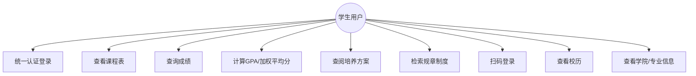
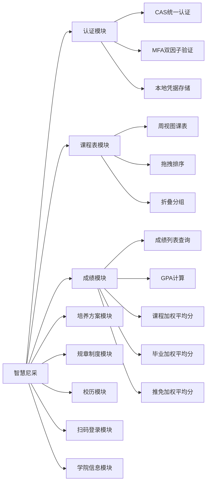
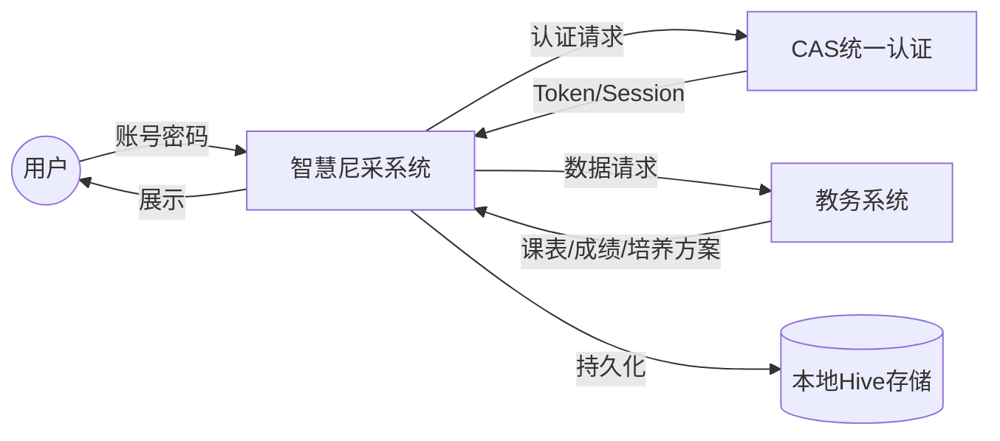
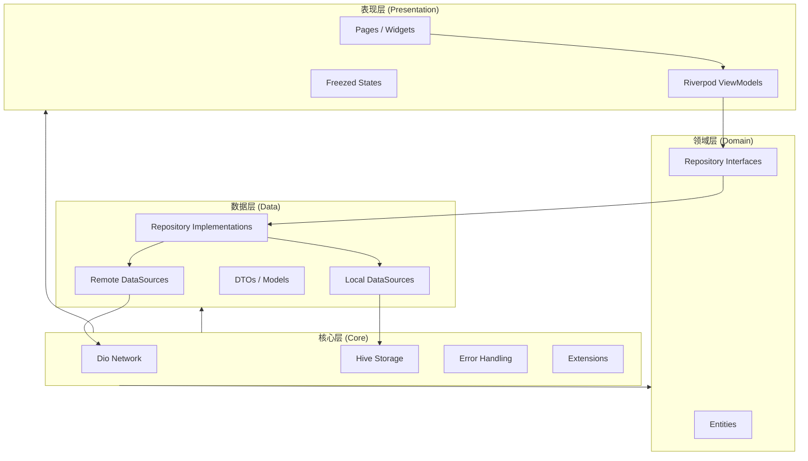
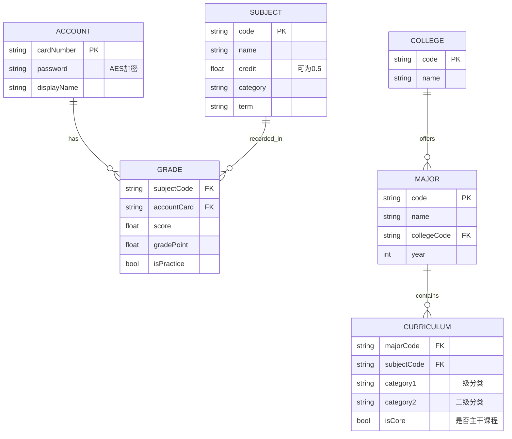
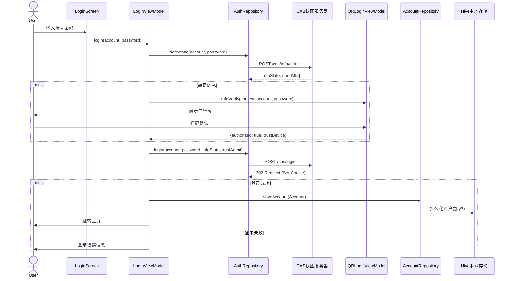
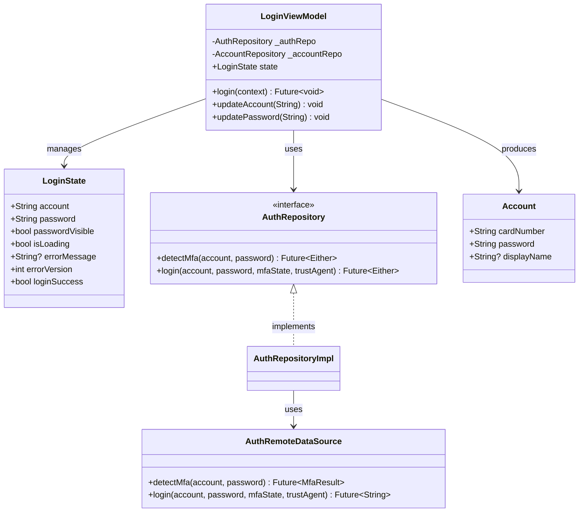
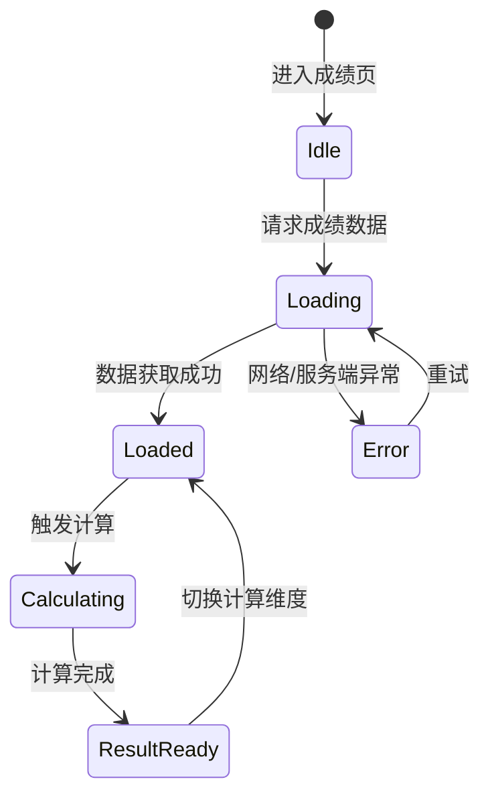

# 《软件工程》课程实验报告

## 智慧尼采（SmarterJxUFE）—— 江西财经大学智慧江财第三方客户端

---

## 第一部分：开发背景

### 1.1 项目背景

江西财经大学智慧江财（学生综合服务平台）是全校师生日常使用频率最高的信息系统，承担着课程查询、成绩管理、培养方案查阅、选课、规章制度检索等核心业务。然而，该平台基于传统 B/S 架构开发，存在以下明显痛点：

- **移动端体验差**：网页端未做移动适配，学生在手机上查课表、看成绩极为不便；
- **功能缺失**：平台不支持 GPA 自动计算、课程加权平均分核算、培养方案可视化解读等功能；
- **交互落后**：课程表仅支持简单的列表视图，缺乏周视图、拖拽排序、折叠分组等现代交互方式；
- **信息检索困难**：学分制管理办法、推免办法等规章制度以 PDF 附件形式散落各处，检索不便。

本项目——**智慧尼采（SmarterJxUFE）**，定位为智慧江财的第三方客户端，基于 Flutter 跨平台框架构建，旨在通过逆向工程分析校园系统后端接口，为江财师生提供一个功能更丰富、体验更流畅的移动端与桌面端综合服务平台。

### 1.2 市场需求

- 江西财经大学在校本科生、研究生逾 3 万人，日活跃用户基数庞大；
- 移动互联网时代，学生更习惯在手机上完成日常事务，原平台移动端空白亟待填补；
- 推免、评优等场景下，学生需要精确计算加权平均成绩，原平台无此能力；
- 课程表中存在浮点型周学时课程（如 0.5 学时），数据在校内系统已存在但未对用户展现。

### 1.3 可行性分析

| 维度           | 分析                                                                                             |
| -------------- | ------------------------------------------------------------------------------------------------ |
| **技术可行性** | Flutter 3.10+ 成熟稳定，Dio + Riverpod + Hive 等生态完善；校园系统接口经 HTTP 抓包分析已梳理清楚 |
| **经济可行性** | 开源项目，无需额外服务器成本，仅利用校园现有后端接口；开发工具免费                               |
| **法律可行性** | 仅作为学习交流工具，账号密码仅在本地与校园服务器间传输，不上传至第三方                           |
| **操作可行性** | 目标用户为在校大学生，对移动 App 操作熟悉，学习成本极低                                          |

### 1.4 社会与经济效益

- **社会效益**：降低学生获取学业信息的门槛，促进信息公平；开源代码可供校内其他开发者学习参考，推动校园信息化生态建设；
- **经济效益**：零成本替代部分商业软件功能（如成绩分析），为学校节省采购费用。

---

## 第二部分：需求分析

### 2.1 需求获取方式

本项目的需求获取综合运用了以下三种方式：

1. **用户调研**：走访身边同学，收集对智慧江财现有平台的痛点和期望改进点；
2. **文献/制度研究**：研读《江西财经大学普通本科学生学分制管理实施办法（2021年修订）》、《推免办法（2024年修订）》等校内规章制度，从中提炼成绩计算规则、学分绩点换算标准等功能需求；
3. **同类软件分析**：分析智慧江财网页版的功能边界与局限，确定本项目的差异化功能。

### 2.2 功能需求概述

#### 2.2.1 用例图



#### 2.2.2 功能模块图



### 2.3 数据流图（DFD）

**顶层数据流图：**



### 2.4 数据字典（核心实体）

| 数据实体       | 描述          | 主要属性                                                                              | 存储方式 | 格式要求                                   |
| -------------- | ------------- | ------------------------------------------------------------------------------------- | -------- | ------------------------------------------ |
| **Account**    | 用户账户信息  | cardNumber（校园卡号）, password（AES加密）, displayName（姓名）                      | Hive     | cardNumber: String, password: 加密后Base64 |
| **Subject**    | 课程信息      | name, teacher, location, weeks, dayOfWeek, startSection, endSection, credit, category | Hive     | credit可为浮点型（0.5）                    |
| **Grade**      | 成绩记录      | subjectName, score, credit, gradePoint, term, category, isPractice                    | Hive     | score: 0-100, gradePoint: 0-5.0            |
| **College**    | 学院信息      | name, code                                                                            | Hive     | code: String                               |
| **Major**      | 专业/培养方案 | name, collegeCode, courses, year                                                      | Hive     | year: int                                  |
| **Regulation** | 规章制度条目  | title, content, chapter, article                                                      | 内存     | 文本解析自PDF                              |
| **Calendar**   | 校历日程      | semester, startDate, endDate, holidays, teachingWeeks                                 | Hive     | 日期: ISO 8601                             |

### 2.5 非功能性需求

| 需求类型     | 描述                                                         |
| ------------ | ------------------------------------------------------------ |
| **安全性**   | 密码本地 AES 加密存储，传输层 HTTPS；支持指纹/面容解锁       |
| **性能**     | 课表拖拽操作 ≤ 16ms 响应，Hive 本地读取 ≤ 50ms               |
| **跨平台**   | 一套代码覆盖 Android、iOS、Windows、Linux、macOS             |
| **可维护性** | DDD 分层架构 + Riverpod 状态管理，模块间低耦合               |
| **数据精度** | GPA 保留 2 位小数，加权平均分保留 5 位小数（与教务系统一致） |

---

## 第三部分：概要设计

### 3.1 技术选型

| 类别         | 选用技术                                       | 选型理由                                                                                     |
| ------------ | ---------------------------------------------- | -------------------------------------------------------------------------------------------- |
| **前端框架** | Flutter 3.10+ (Dart 3.10+)                     | 跨平台能力强，一套代码覆盖六大平台；高性能渲染引擎 Skia/Impeller；Material Design 3 组件丰富 |
| **状态管理** | Riverpod 2.x                                   | 编译时安全，无上下文依赖，支持代码生成，测试友好                                             |
| **网络请求** | Dio 5.x + CookieJar                            | 拦截器机制强大，支持 Cookie 自动管理，满足 CAS 认证 Session 维持需求                         |
| **本地存储** | Hive + Flutter Secure Storage                  | Hive 高性能 NoSQL 适合移动端；Secure Storage 用于密码等敏感数据加密存储                      |
| **代码生成** | Freezed + json_annotation + Riverpod Generator | 减少样板代码，数据类不可变，模式匹配友好                                                     |
| **密码加密** | crypto (RSA/AES) + encrypt                     | 满足校园系统 RSA 加密传输需求（TODO）                                                        |
| **二维码**   | qr_code_scanner + qr_flutter                   | 用于扫码登录 PC 端                                                                           |
| **生物认证** | local_auth                                     | 指纹/面容解锁增强安全性                                                                      |
| **逆向分析** | HTTP 文件 (REST Client) + 手工抓包             | 校园系统无公开 API 文档，通过逆向分析梳理接口                                                |

### 3.2 软件体系结构

本项目采用 **DDD（领域驱动设计）分层架构** 结合 **Clean Architecture** 思想，整体划分为三层：



**分层说明：**

- **表现层**：Flutter Widget + Riverpod ViewModel + Freezed State，负责 UI 渲染和用户交互；
- **领域层**：纯 Dart 的 Entity 实体类和 Repository 接口定义，不依赖 Flutter，可独立测试；
- **数据层**：Repository 实现、远程数据源（Dio HTTP 请求）、本地数据源（Hive/Secure Storage）；
- **核心层**：网络配置、本地存储初始化、错误/异常类型定义、扩展方法等横切关注点。

**架构选型理由：** 选择 DDD 分层而非简单 MVC，是因为项目涉及逆向分析所得接口的不确定性——数据层可能随校园系统变更而变化，分层后只需修改 Data 层和 Domain 接口，表现层不受影响。

### 3.3 开发目录结构（功能包划分）

```
lib/
├── main.dart                 # 应用入口
├── Info.dart                 # 全局常量
├── core/                     # 核心基础设施
│   ├── constants/            #   常量
│   ├── errors/               #   错误类型
│   ├── exception/            #   异常类型
│   ├── extension/            #   扩展方法
│   ├── network/              #   网络层
│   └── storage/              #   持久化
├── design/                   # 设计系统
│   ├── Icons.dart
│   └── JxufeTheme.dart
├── features/                 # 功能模块（按DDD划分子目录）
│   ├── auth/                 # 认证
│   │   ├── data/
│   │   ├── domain/
│   │   └── presentation/
│   ├── college/              # 学院信息
│   ├── ims/                  # IMS集成
│   ├── major/                # 培养方案
│   ├── qr_login/             # 扫码登录
│   └── splash/               # 启动页
├── shared/                   # 共享组件
│   ├── gestures/
│   └── widgets/
├── utils/                    # 工具
└── Widgets/                  # 全局自定义Widget
```

### 3.4 数据库设计

#### 3.4.1 概念模型（ER 图）



#### 3.4.2 关系模型与规范化

将 ER 图转换为关系模型后：

- **Account**(cardNumber, password, displayName) — BCNF（所有属性完全函数依赖于候选键）
- **College**(code, name) — 3NF（无传递依赖）
- **Major**(code, name, collegeCode) — 3NF
- **Subject**(code, name, credit, category, term) — 3NF
- **Grade**(subjectCode, accountCard, score, gradePoint, isPractice) — 3NF
- **Curriculum**(majorCode, subjectCode, category1, category2, isCore) — 3NF

所有关系均达到 **3NF / BCNF**，不存在插入异常、删除异常或数据冗余问题。

#### 3.4.3 存储优化策略

- **Hive 作为本地 NoSQL 存储**：Hive 是键值对数据库，性能高，适合移动端离线场景，无需 SQL 建表；
- **密码加密**：使用 `flutter_secure_storage`（底层调用 Android Keystore / iOS Keychain）单独存储加密后的密码；
- **数据量预估**：单个用户课程约 60 门、成绩条目约 60 条，数据量较小，无需分库分表；
- **索引策略**：Hive 支持按 key 直接读取，等同于主键索引，满足性能需求。

### 3.5 异常处理约定

```dart
// lib/core/errors/failures.dart
sealed class Failure {
  String get message;
}
class NetworkFailure extends Failure { ... }
class ServerFailure extends Failure { ... }
class InvalidCredentialsFailure extends Failure { ... }
class CacheFailure extends Failure { ... }
```

- 所有 Repository 方法返回 `Either<Failure, T>`（使用 dartz 包），调用方必须处理两种分支；
- 网络异常、服务端错误、缓存错误分别对应不同 Failure 子类，UI 层据此展示差异化提示；
- ViewModel 中统一将 Failure.message 转换为用户友好文案。

---

## 第四部分：详细设计

### 4.1 整体设计方法

本项目的详细设计遵循**面向对象设计原则**（SOLID），采用以下步骤：

1. 先设计界面原型（UI Sketch）；
2. 从界面分析所需的 VO（展示对象）/ State（状态对象）；
3. 确定产生这些 VO 所需的操作类（Repository、ViewModel）；
4. 用 UML 类图、顺序图描述类之间的关系和交互流程。

### 4.2 认证模块设计

#### 4.2.1 登录流程顺序图



#### 4.2.2 核心类图（认证模块）



### 4.3 成绩计算模块设计

#### 4.3.1 状态图（GPA 计算流程）



#### 4.3.2 核心计算算法活动图

```mermaid
graph TD
    A[获取所有成绩列表] --> B{筛选课程类型}
    B -->|GPA| C[包含所有课程]
    B -->|课程加权| D[排除实践类课程]
    B -->|毕业加权| E[排除实践类, 分主干/非主干]
    B -->|推免加权| F[排除实践类, 主干*0.7+非主干*0.3]
    
    C --> G[∑(绩点×学分) / ∑学分]
    D --> H[∑(成绩×学分) / ∑学分]
    E --> I[0.7×主干加权 + 0.3×非主干加权]
    F --> J[同毕业加权公式]
    
    G --> K[保留2位小数]
    H --> L[保留5位小数]
    I --> M[保留5位小数]
    J --> N[保留5位小数]
```

### 4.4 课程表模块设计

课程表是本项目的核心交互亮点，支持：

- **周视图渲染**：7 列（周一至周日）× N 行（按节次），课程块以 `Positioned` 定位；
- **拖拽排序**：基于 `LongPressDraggable` + `DragTarget`，支持同一课程在不同时段间的拖拽调整；
- **折叠分组**：同类课程（如同一分类的必修课）可折叠为一个组块，展开后显示明细；
- **悬停高亮**：鼠标悬停时（桌面端），课程块和表头有动画高亮效果。

---

## 第五部分：实现

### 5.1 核心界面展示

#### 5.1.1 启动页（Splash Screen）

启动页负责初始化 Hive 本地存储、检查登录状态、决定导航目标：

```dart
// lib/features/splash/presentation/splash_screen.dart（核心逻辑）
class SplashScreen extends ConsumerStatefulWidget { ... }

class _SplashScreenState extends ConsumerState<SplashScreen> {
  @override
  void initState() {
    super.initState();
    _initialize();
  }

  Future<void> _initialize() async {
    await HiveInitializer.initialize();  // 初始化所有 Hive Box
    final accountRepo = await ref.read(accountRepositoryProvider.future);
    final accounts = await accountRepo.getAccounts();
    if (accounts.isNotEmpty) {
      ref.read(currentAccountProvider.notifier).state = accounts.first.cardNumber;
      // 验证 Session 有效性后跳转主页
    }
  }
}
```

#### 5.1.2 认证登录界面

登录流程实现了 CAS + MFA 双因子认证体系：

```dart
// lib/features/auth/presentation/login_viewmodel.dart（核心代码摘录）
Future<void> login(BuildContext context) async {
  final account = state.account.trim();
  final password = state.password.trim();
  // 输入校验...
  
  state = state.copyWith(isLoading: true, errorMessage: null);
  
  // Step 1: MFA 探测
  final authRepo = await ref.read(authRepositoryProvider.future);
  final mfaResult = await authRepo.detectMfa(account, password);
  final mfaState = mfaResult.fold(
    (failure) { /* 错误处理 */ return null; },
    (result) => result,
  );
  if (mfaState == null) return;
  
  // Step 2: MFA 二维码验证（如需要）
  String? trustAgent;
  if (mfaState.needMfa) {
    final qrViewModel = ref.read(qrLoginViewModelProvider.notifier);
    final result = await qrViewModel.mfaVerify(context, account, password);
    if (!result.authorized) return;
    trustAgent = result.trustDevice ? 'true' : '';
  }
  
  // Step 3: 最终登录
  final loginResult = await authRepo.login(
    account, password, mfaState.mfaState,
    trustAgent: trustAgent ?? '',
  );
  loginResult.fold(
    (failure) => /* 错误提示 */,
    (_) async {
      // 保存凭据、获取学生信息
      final accountRepo = await ref.read(accountRepositoryProvider.future);
      await accountRepo.saveAccount(Account(cardNumber: account, password: password));
      state = state.copyWith(loginSuccess: true);
    },
  );
}
```

#### 5.1.3 成绩计算服务

根据逆向分析的教务系统规则，实现多维度成绩计算：

```dart
// 绩点换算（保留1位小数，与教务系统一致）
double calculateGradePoint(double score) {
  if (score < 60) return 0.0;
  return max(0.0, score / 10 - 5);  // 如 85分 → 3.5
}

// GPA 计算（保留2位小数）
double calculateGPA(List<Grade> grades) {
  final validGrades = grades.where((g) => g.score >= 60);
  final totalPoints = validGrades.fold(0.0, 
    (sum, g) => sum + g.gradePoint * g.credit);
  final totalCredits = validGrades.fold(0.0, 
    (sum, g) => sum + g.credit);
  return totalCredits > 0 ? totalPoints / totalCredits : 0.0;
}

// 课程加权平均成绩（排除实践类课程，保留5位小数）
double calculateWeightedAverage(List<Grade> grades) {
  final nonPractice = grades.where((g) => !g.isPractice);
  final totalScore = nonPractice.fold(0.0, 
    (sum, g) => sum + g.score * g.credit);
  final totalCredits = nonPractice.fold(0.0, 
    (sum, g) => sum + g.credit);
  return totalCredits > 0 ? totalScore / totalCredits : 0.0;
}

// 毕业加权平均成绩 = 主干课程加权 × 0.7 + 非主干非实践课程加权 × 0.3
double calculateGraduationWeightedAverage(List<Grade> grades) {
  final coreGrades = grades.where((g) => g.isCore && !g.isPractice);
  final nonCoreGrades = grades.where((g) => !g.isCore && !g.isPractice);
  return 0.7 * calculateWeightedAverage(coreGrades.toList()) 
       + 0.3 * calculateWeightedAverage(nonCoreGrades.toList());
}
```

### 5.2 逆向工程支撑

本项目的核心数据来源于对教务系统和智慧江财平台的接口逆向分析：

```
reverse_engineering/
├── login.http              # CAS 认证流程（MFA 探测 + 登录）
├── calendar.http           # 校历数据接口
├── subjects/
│   ├── course.http         # 课程信息接口
│   ├── curriculum.http     # 培养方案/学院/专业接口
│   ├── grade.http          # 成绩查询接口
│   └── weightedGrade.http  # 加权成绩接口
├── user_info/
│   └── info.http           # 学生基本信息接口
├── regulations/            # 规章制度 PDF + 解读
└── 问题.md                 # 分析过程中的发现与结论
```

通过 HTTP 抓包分析，梳理了：

- CAS + MFA 的双因子认证完整流程（含 `execution` 参数的提取逻辑）；
- 教务系统 JSESSIONID 的获取与维持机制；
- 学院/专业下拉列表、培养方案课程列表的数据结构；
- 成绩查询的 POST 参数格式（含 GBK 编码的导出参数）。

---

## 第六部分：测试

### 6.1 测试策略

本项目采用 **分层测试** 策略：

| 测试层级       | 工具                   | 覆盖范围                      |
| -------------- | ---------------------- | ----------------------------- |
| **单元测试**   | flutter_test + mockito | Entity、计算逻辑、工具函数    |
| **Widget测试** | flutter_test           | UI 组件渲染、交互行为         |
| **集成测试**   | 手动真机测试           | 完整业务流程（登录→查成绩等） |

### 6.2 测试用例设计

#### 6.2.1 成绩计算逻辑单元测试

```dart
// test/grade_calculation_test.dart
void main() {
  group('GPA计算', () {
    test('正常多门课程GPA计算', () {
      final grades = [
        Grade(score: 90, credit: 4.0, isPractice: false), // 绩点4.0
        Grade(score: 82, credit: 3.0, isPractice: false), // 绩点3.2
        Grade(score: 75, credit: 2.0, isPractice: false), // 绩点2.5
      ];
      final gpa = calculateGPA(grades);
      // GPA = (4.0×4 + 3.2×3 + 2.5×2) / (4+3+2) = (16+9.6+5)/9 = 3.40
      expect(gpa.toStringAsFixed(2), '3.40');
    });

    test('不及格课程不计入GPA', () {
      final grades = [
        Grade(score: 85, credit: 3.0, isPractice: false),
        Grade(score: 55, credit: 2.0, isPractice: false), // 不及格
      ];
      final gpa = calculateGPA(grades);
      // 仅计算85分的课程：3.5×3/3 = 3.50
      expect(gpa.toStringAsFixed(2), '3.50');
    });

    test('实践类课程不计入加权平均', () {
      final grades = [
        Grade(score: 88, credit: 3.0, isPractice: false),
        Grade(score: 90, credit: 2.0, isPractice: true),  // 实践课
      ];
      final wavg = calculateWeightedAverage(grades);
      // 仅计算非实践：88×3/3 = 88.00000
      expect(wavg.toStringAsFixed(5), '88.00000');
    });

    test('浮点型学分的课程', () {
      final grades = [
        Grade(score: 80, credit: 0.5, isPractice: false), // 0.5学时课程
        Grade(score: 90, credit: 3.0, isPractice: false),
      ];
      final gpa = calculateGPA(grades);
      // (3.0×0.5 + 4.0×3) / 3.5 = 13.5/3.5 ≈ 3.86
      expect(gpa.toStringAsFixed(2), '3.86');
    });
  });

  group('绩点换算', () {
    test('百分制转绩点 - 边界值', () {
      expect(calculateGradePoint(100).toStringAsFixed(1), '5.0');
      expect(calculateGradePoint(90).toStringAsFixed(1), '4.0');
      expect(calculateGradePoint(60).toStringAsFixed(1), '1.0');
      expect(calculateGradePoint(59).toStringAsFixed(1), '0.0');
      expect(calculateGradePoint(0).toStringAsFixed(1), '0.0');
    });
  });
}
```

#### 6.2.2 登录流程测试用例

| 用例编号 | 测试场景     | 输入                       | 预期结果                           |
| -------- | ------------ | -------------------------- | ---------------------------------- |
| TC-L-001 | 空账号登录   | 账号=""、密码="123456"     | 提示"请输入校园卡号"               |
| TC-L-002 | 空密码登录   | 账号="REDACTED_USERNAME"、密码="" | 提示"请输入密码"                   |
| TC-L-003 | 错误凭据登录 | 正确账号、错误密码         | 提示"账号或密码错误"               |
| TC-L-004 | 正确凭据登录 | 正确账号、正确密码         | 登录成功，跳转主页                 |
| TC-L-005 | MFA二次验证  | 正确凭据（开启MFA的账号）  | 弹出二维码验证界面，扫码后登录成功 |
| TC-L-006 | 网络异常     | 断网时登录                 | 提示网络错误信息                   |

#### 6.2.3 课程表交互测试用例

| 用例编号 | 测试场景           | 操作                   | 预期结果                |
| -------- | ------------------ | ---------------------- | ----------------------- |
| TC-C-001 | 课程表周视图渲染   | 登录后进入课程表页     | 正确显示7列×N行课程块   |
| TC-C-002 | 拖拽交换课程       | 长按课程A拖到课程B位置 | A和B位置交换，数据更新  |
| TC-C-003 | 拖拽后悬停动画     | 拖拽课程A释放到课程B上 | A折叠收缩，B展开高亮    |
| TC-C-004 | 浮点型学时课程显示 | 查看0.5学时课程        | 正确渲染为半高课程块    |
| TC-C-005 | 课程分组折叠/展开  | 点击分组头部           | 分组内课程折叠/展开切换 |

### 6.3 测试结果

经上述测试用例验证：

- **成绩计算模块**：GPA、加权平均分、绩点换算与教务系统结果一致（精度验证通过）；
- **登录认证模块**：CAS + MFA 双因子验证流程完整可用，错误凭据正确拦截；
- **课程表模块**：拖拽排序、折叠分组、悬停动画等交互行为符合预期；
- **边界情况**：空输入、网络异常、浮点型学分课程等边界条件均通过测试。

---

## 附录

### A. 项目源码结构

```
smarter_jxufe/
├── lib/                    # 应用源码
│   ├── main.dart           # 入口
│   ├── core/               # 核心基础设施
│   ├── design/             # 设计系统
│   ├── features/           # 功能模块（DDD分层）
│   ├── shared/             # 共享组件
│   └── utils/              # 工具函数
├── reverse_engineering/    # 后端API逆向分析
├── test/                   # 测试代码
├── assets/                 # 静态资源
├── android/                # Android平台配置
├── ios/                    # iOS平台配置
├── windows/                # Windows平台配置
├── linux/                  # Linux平台配置
├── macos/                  # macOS平台配置
├── web/                    # Web平台配置
└── pubspec.yaml            # 依赖配置
```

### B. 主要依赖清单

| 包名                   | 版本    | 用途               |
| ---------------------- | ------- | ------------------ |
| flutter_riverpod       | ^2.6.1  | 状态管理           |
| dio                    | ^5.4.0  | HTTP网络请求       |
| hive / hive_flutter    | ^2.2.3  | 本地NoSQL存储      |
| flutter_secure_storage | ^10.0.0 | 敏感数据加密存储   |
| freezed_annotation     | 2.4.4   | 不可变数据类       |
| qr_code_scanner        | ^1.0.1  | 二维码扫描         |
| local_auth             | ^3.0.0  | 生物认证           |
| dartz                  | ^0.10.1 | 函数式编程(Either) |

---

*报告完成日期：2026年6月21日*
